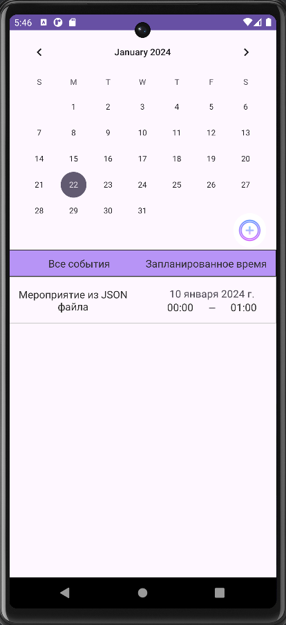
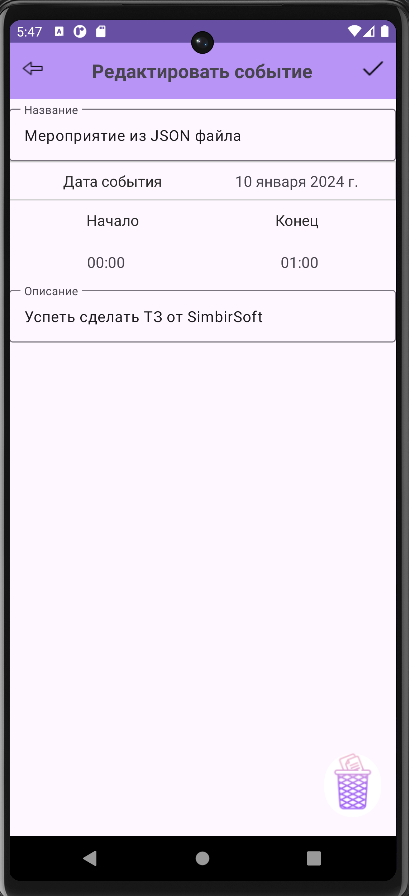
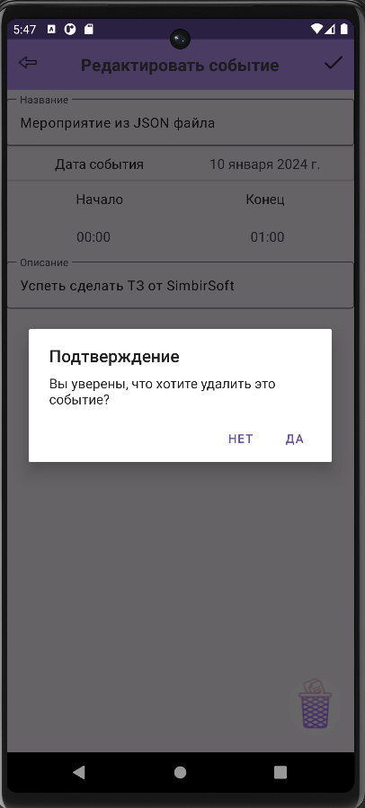
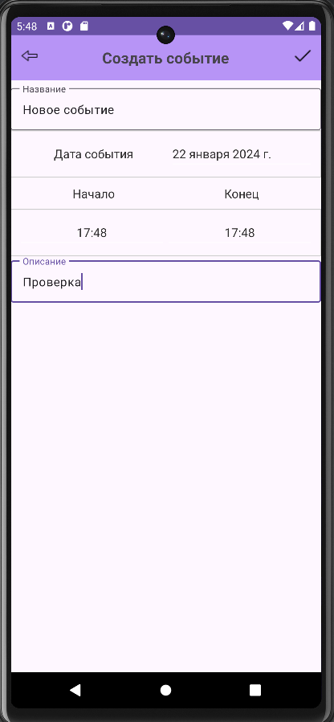
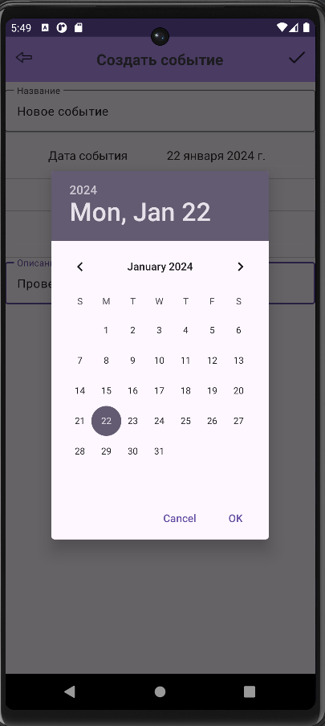
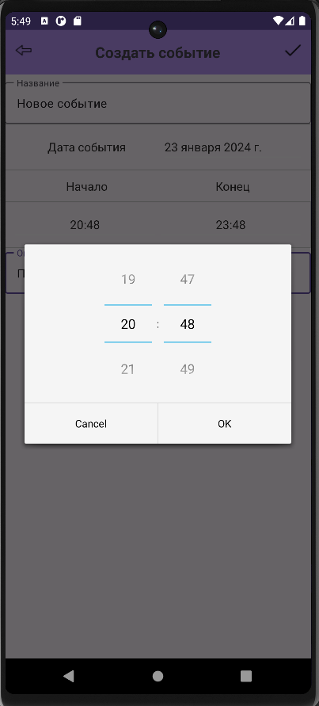
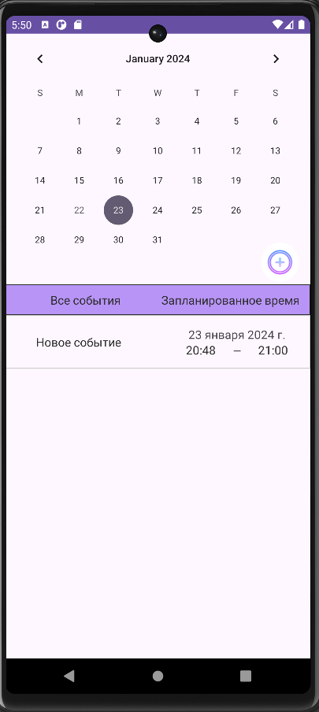
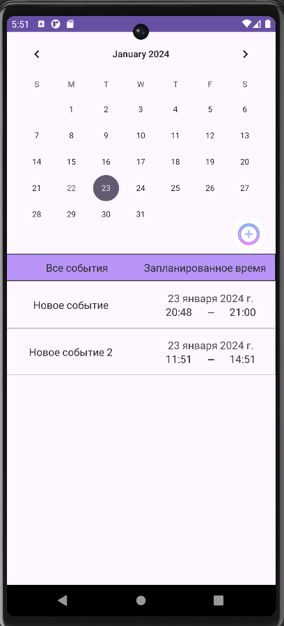

# Тестовое задание для прохождения на Android Mobile - практикум от SimbirSoft

# Описание

### Описание приложения

> В приложении присутствуют 3 экрана: Экран с списком дел по датам, экран детального описания дела с возможностью удаления и редактирования,
> экран добавления дела
> ### Основной экран:
>> + Календарь с выбором даты
>> + Таблица дел
>> + Кнопка "Добавить дело"
> ### Детальный экран дела:
>> + Поле для изменения названия дела
>> + Изменение даты
>> + Изменение времени начала дела
>> + Изменение времени окончания дела
>> + Поле для изменения описания дела
>> + Кнопка "Изменить информацию"
>> + Кнопка "Удалить задачу"
>> + Кнопка "Вернуться назад"
> ### Экран добавления дела:
>> + Поле для ввода названия задачи
>> + Выбор даты
>> + Выбор времени начала дела
>> + Выбор времени окончания дела
>> + Поле для ввода описания задачи
>> + Кнопка "Вернуться назад"
>> + Кнопка "Добавить задачу"

# Примечания

> + Реализован парсинг JSON файла и его отображения на экране, создана база данных для дальнейшего сохранения и удаления дел.
> + Каждое дело расположено в том дне календаря, согласно которому оно было запланировано.
> + Релизована возможность переноса дела с одного дня на другой при помощи фильтрации по дате.
> + Все созданные события хранятся в локальной базе данных Room.
> + В те дни, в которые ничего не запланировано, отображается событие из JSON файла.

# О проекте

> + Архитектура - MVVM + CleanArchitecture
> + Технологии: Room, Koin, Navigation component, Kotlin Coroutines, StateFlow, ViewBinding, Retrofit, Moshi
> + Добавлен статический анализатор Ktlint

# Скриншоты экранов

